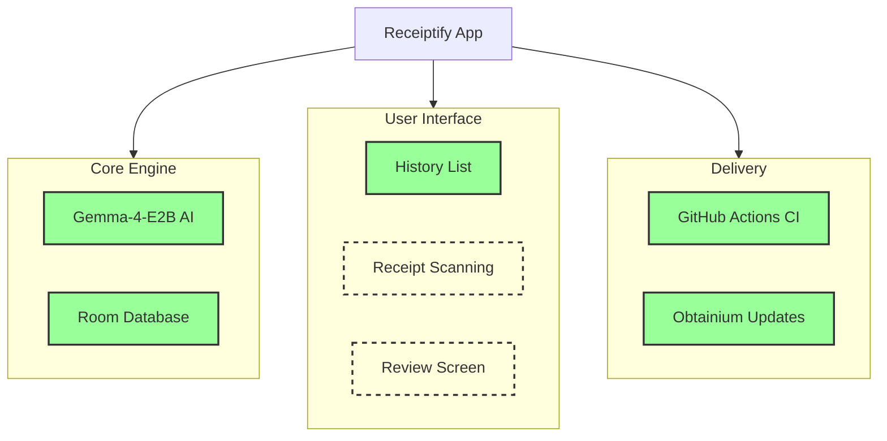

# Offline Personal Finance Tracker

Welcome to the Offline Personal Finance Tracker! This Android application is designed to securely and efficiently manage your financial records entirely on-device, prioritizing your privacy.

## Features

- **100% On-Device AI:** Analyzes receipts using the **Gemma-4-E2B-it** edge model directly on your device.
- **Multimodal Processing:** No need for traditional OCR APIs (like ML Kit) or cloud services. The raw receipt image and prompt are fed right into the local model.
- **Offline First:** Your data never leaves your device. All processing and storage happen locally.
- **Data Validation:** A Review Screen allows you to verify the extracted information before saving it to your records.

## Project Roadmap & Features

### Roadmap Checklist
#### Core Engine
- [x] On-Device AI Integration (Gemma-4-E2B)
- [x] Local Storage (Room Database)
- [ ] Model Auto-downloading System **(Planned: see docs/plans/model_management.md)**

#### User Interface
- [x] Transaction History List
- [ ] Receipt Capture (Camera) **(Stub: FAB button exists but inactive)**
- [ ] Gallery Image Selection **(Not implemented)**
- [ ] Review Screen (Data Validation) **(Not implemented)**
- [ ] Settings Screen **(Not implemented)**

#### DevOps & Delivery
- [x] GitHub Actions CI/CD
- [x] Automated Releases (Latest & Pre-releases)
- [x] Obtainium Support
- [x] CI Path-based Optimization

## Current Stubs & Limitations
- **Add Transaction Button:** The Floating Action Button (FAB) on the main screen is currently a UI placeholder.
- **Model Management:** The Gemma model must be manually placed in `app/src/main/assets/`. Automatic downloading or external storage management is not yet implemented.
- **Scanning Logic:** While the `ReceiptAnalyzer` class is ready, it is not yet connected to any UI flow.

## Architecture & Tech Stack

- **Language:** Kotlin
- **UI Framework:** Jetpack Compose (Material 3)
- **Architecture:** MVVM (Model-View-ViewModel) with Coroutines and Flow
- **Local Database:** Room Database
- **Offline ML:** LiteRT-LM / MediaPipe GenAI for local multimodal LLM inference

## Data Entry Flow

1. **Capture:** Take a picture of your receipt or select one from your gallery.
2. **Analyze:** The image and a prompt are sent to the local Gemma 4 E2B model.
3. **Review:** The model returns a parsed JSON with shop name, date, total amount, and items. You review this data on the Review Screen.
4. **Save:** Once validated, the data is saved securely to the Room Database.

## Setup Instructions

### Prerequisites
- Android Studio
- JDK 17
- An Android device or emulator (Note: On-device inference performs best on physical devices with decent hardware).

### Model Installation
This app requires the `gemma-4-E2B-it-int4` model file to function. Due to size constraints, it is not bundled in the repository.

1. Obtain the `gemma-4-E2B-it-int4.bin` or `.task` model file.
2. Place the model file in the following directory within the project:
   `app/src/main/assets/`

   *(Note: For production, it's recommended to download the model at runtime to internal storage due to APK size limits).*

### Build and Run
1. Clone the repository.
2. Open the project in Android Studio.
3. Sync the project with Gradle files.
4. Run the application on your target device or emulator.

## Releases & Installation
This project uses GitHub Actions to automatically build and release new versions of the application.

- **Direct Download:** You can find the latest APKs in the [Releases](https://github.com/Dizit3/Receiptify/releases) section.
- **Obtainium:** To get automatic updates, add this repository URL to [Obtainium](https://github.com/ImranR98/Obtainium). Every push to `main` will trigger a new build that Obtainium can detect.
